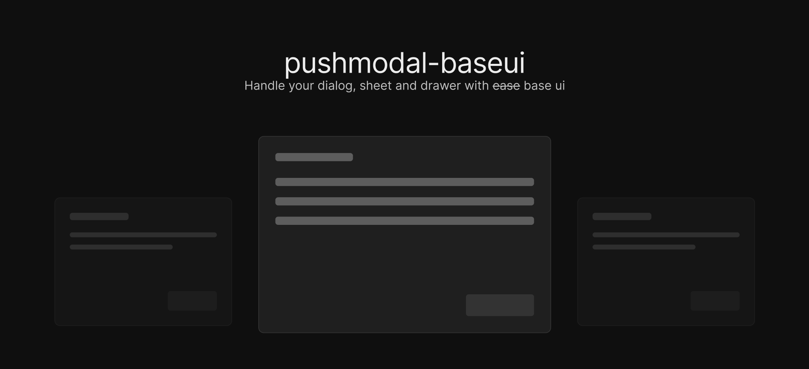

<br />
<br />

# pushmodal (Base UI Port)

A stack-based modal management library for React, built for [Base UI](https://base-ui.com/).

> This is a port of the original [pushmodal](https://github.com/lindesvard/pushmodal) by [Carl Lindesvard](https://github.com/lindesvard), migrated from Radix UI to Base UI.

## Installation

```bash
pnpm add pushmodal @base-ui/react
```

For drawer support, also install:

```bash
pnpm add vaul-base
```

## Usage

#### 1. Create a modal

When creating a dialog/sheet/drawer you need to wrap your component with the appropriate content component. Skip the `Root` since pushmodal handles that for you.

```tsx
// file: src/modals/modal-example.tsx
import { Dialog } from '@base-ui/react/dialog';

export default function ModalExample({ foo }: { foo: string }) {
  return (
    <Dialog.Portal>
      <Dialog.Backdrop className="fixed inset-0 bg-black/50" />
      <Dialog.Popup className="fixed left-1/2 top-1/2 -translate-x-1/2 -translate-y-1/2 bg-white p-6 rounded-lg">
        <Dialog.Title>Your modal</Dialog.Title>
        <Dialog.Description>Modal content here: {foo}</Dialog.Description>
        <Dialog.Close>Close</Dialog.Close>
      </Dialog.Popup>
    </Dialog.Portal>
  );
}
```

For drawers using vaul-base:

```tsx
// file: src/modals/drawer-example.tsx
import { Drawer } from 'vaul-base';

export default function DrawerExample() {
  return (
    <Drawer.Portal>
      <Drawer.Overlay className="fixed inset-0 bg-black/50" />
      <Drawer.Content className="fixed bottom-0 left-0 right-0 bg-white rounded-t-lg p-6">
        Drawer content
      </Drawer.Content>
    </Drawer.Portal>
  );
}
```

#### 2. Initialize your modals

```tsx
// file: src/modals/index.tsx (alias '@/modals')
import ModalExample from './modal-example';
import SheetExample from './sheet-example';
import DrawerExample from './drawer-example';
import { createPushModal } from 'pushmodal';
import { Drawer } from 'vaul-base';

export const {
  pushModal,
  popModal,
  popAllModals,
  replaceWithModal,
  useOnPushModal,
  onPushModal,
  ModalProvider,
} = createPushModal({
  modals: {
    // Short hand - uses Dialog.Root from @base-ui/react as wrapper
    ModalExample,
    SheetExample,

    // Longer definition for custom wrappers (e.g., vaul-base Drawer)
    DrawerExample: {
      Wrapper: Drawer.Root,
      Component: DrawerExample,
    },
  },
});
```

Recommended project structure:

```
src
├── ...
├── modals
│   ├── modal-example.tsx
│   ├── sheet-example.tsx
│   ├── drawer-example.tsx
│   ├── ... more modals here ...
│   └── index.tsx
├── ...
└── ...
```

#### 3. Add the `<ModalProvider />` to your root file

```tsx
import { ModalProvider } from '@/modals';

export default function App({ children }: { children: React.ReactNode }) {
  return (
    <>
      {/* Notice! You should not wrap your children */}
      <ModalProvider />
      {children}
    </>
  );
}
```

#### 4. Use `pushModal`

`pushModal` accepts 1-2 arguments:

1. `name` - name of your modal
2. `props` (optional) - props for your modal, types are inferred from your component

```tsx
import { pushModal } from '@/modals';

export default function RandomComponent() {
  return (
    <div>
      <button onClick={() => pushModal('ModalExample', { foo: 'string' })}>Open modal</button>
      <button onClick={() => pushModal('SheetExample')}>Open Sheet</button>
      <button onClick={() => pushModal('DrawerExample')}>Open Drawer</button>
    </div>
  );
}
```

#### 5. Closing modals

You can close modals in three different ways:

- `popModal()` - pops the last added modal
- `popModal('Modal1')` - pops the last added modal with name `Modal1`
- `popAllModals()` - closes all modals

#### 6. Replacing current modal

Replace the last pushed modal. Same interface as `pushModal`.

```ts
replaceWithModal('SheetExample', {
  /* Props if any */
});
```

#### 7. Using events

Listen to modal events with `useOnPushModal` (inside React components) or `onPushModal` (globally).

Events receive the modal state (open/closed), name, and props. Use `*` to listen to all modals or provide a specific modal name.

**Inside a component**

```tsx
import { useCallback } from 'react';
import { useOnPushModal } from '@/modals';

export default function ReactComponent() {
  // Listen to any modal open/close
  useOnPushModal(
    '*',
    useCallback((open, props, name) => {
      console.log('is open?', open);
      console.log('props from component', props);
      console.log('name', name);
    }, [])
  );

  // Listen to specific modal
  useOnPushModal(
    'ModalExample',
    useCallback((open, props) => {
      console.log('is `ModalExample` open?', open);
      console.log('props for ModalExample', props);
    }, [])
  );
}
```

**Globally**

```ts
import { onPushModal } from '@/modals';

const unsub = onPushModal('*', (open, props, name) => {
  // do stuff
});
```

#### Responsive rendering (mobile/desktop)

Show a drawer on mobile and a dialog on desktop using `createResponsiveWrapper`:

```tsx
// path: src/modals/dynamic.tsx
import { createResponsiveWrapper } from 'pushmodal';
import { Dialog } from '@base-ui/react/dialog';
import { Drawer } from 'vaul-base';

// Create your styled content components
const DialogContent = ({ children }: { children: React.ReactNode }) => (
  <Dialog.Portal>
    <Dialog.Backdrop className="fixed inset-0 bg-black/50" />
    <Dialog.Popup className="fixed left-1/2 top-1/2 -translate-x-1/2 -translate-y-1/2 bg-white p-6 rounded-lg">
      {children}
    </Dialog.Popup>
  </Dialog.Portal>
);

const DrawerContent = ({ children }: { children: React.ReactNode }) => (
  <Drawer.Portal>
    <Drawer.Overlay className="fixed inset-0 bg-black/50" />
    <Drawer.Content className="fixed bottom-0 left-0 right-0 bg-white rounded-t-lg p-6">
      {children}
    </Drawer.Content>
  </Drawer.Portal>
);

export default createResponsiveWrapper({
  desktop: {
    Wrapper: Dialog.Root,
    Content: DialogContent,
  },
  mobile: {
    Wrapper: Drawer.Root,
    Content: DrawerContent,
  },
  breakpoint: 640,
});

// path: src/modals/your-modal.tsx
import * as Dynamic from './dynamic';

export default function YourModal() {
  return <Dynamic.Content>Drawer on mobile, dialog on desktop</Dynamic.Content>;
}

// path: src/modals/index.ts
import * as Dynamic from './dynamic';
import YourModal from './your-modal';
import { createPushModal } from 'pushmodal';

export const {
  pushModal,
  popModal,
  popAllModals,
  replaceWithModal,
  useOnPushModal,
  onPushModal,
  ModalProvider,
} = createPushModal({
  modals: {
    YourModal: {
      Wrapper: Dynamic.Wrapper,
      Component: YourModal,
    },
  },
});
```

## API Reference

### `createPushModal(options)`

Creates the modal system. Returns:

- `ModalProvider` - React component to render at root level
- `pushModal(name, props?)` - Open a modal by name
- `popModal(name?)` - Close the last modal or a specific one
- `popAllModals()` - Close all modals
- `replaceWithModal(name, props?)` - Replace current modal
- `onPushModal(name, callback)` - Global event listener
- `useOnPushModal(name, callback)` - React hook event listener

### `createResponsiveWrapper(options)`

Creates responsive wrapper components for mobile/desktop switching.

## Migration from Radix UI version

If you're migrating from the original pushmodal (Radix UI version):

1. Replace `@radix-ui/react-dialog` with `@base-ui/react`
2. Replace `vaul` with `vaul-base`
3. Update your modal components to use Base UI primitives:
   - `Dialog.Content` -> `Dialog.Popup`
   - `Dialog.Overlay` -> `Dialog.Backdrop`
   - Data attributes: `data-[state=open]` -> `data-open`

## Credits

- Original [pushmodal](https://github.com/lindesvard/pushmodal) by [Carl Lindesvard](https://github.com/lindesvard)
- [Base UI](https://base-ui.com/) by MUI team
- [vaul-base](https://github.com/borabaloglu/vaul-base) by [Bora Baloglu](https://github.com/borabaloglu)

## License

MIT
